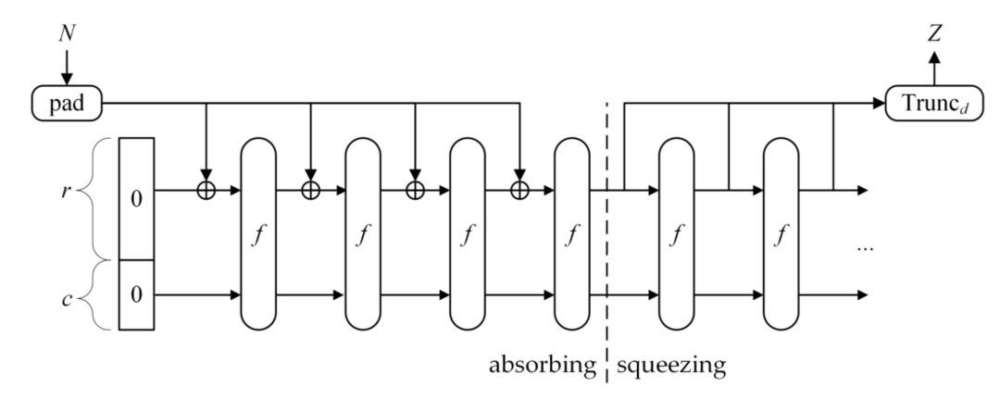

[](EnglishReadme.md)

# 单向散列函数算法深入

# 一. 简介

单向散列函数，又称单向Hash函数、杂凑函数，就是把任意长度的输入消息串变化成固定长的输出串且由输出串难以得到输入串的一种函数。这个输出串称为该消息的散列值。一般用于产生消息摘要，密钥加密等.

# 二. MD5 算法

## 1. MD5 简介

MD5：是RSA数据安全公司开发的一种单向散列算法，MD5 被广泛使用，可以用来把不同长度的数据块进行暗码运算成一个128 位的数值。不同的值产生的结果不一样。

## 2.MD5 算法流程

对 MD5 算法简要的叙述可以为：MD5 以 512 位分组来处理输入的信息，且每一分组又被划分为 16 个 32 位子分组，经过了一系列的处理后，算法的输出由四个32 位分组组成，将这四个 32 位分组级联后将生成一个 128 位散列值。

**第一步. 填充：**如果输入信息的长度(bit)对 512 求余的结果不等于 448，就需要填充使得对 512 求余的结果等于 448。填充的方法是填充一个 1 和 n 个 0。填充完后，信息的长度就为 N* 512 + 448 (bit)

**第二步. 记录信息长度：**用64位来存储填充前信息长度。这64位加在第一步结果的后面，这样信息长度就变为 N * 512+448+64=(N+1)*512位。

**第三步. 装入标准的幻数（四个整数）：**标准的幻数（物理顺序）是

```
A=(01234567)16，
B=(89ABCDEF)16，
C=(FEDCBA98)16，
D=(76543210)16
```

如果在程序中定义应该是:

```
A=0X67452301L
B=0XEFCDAB89L
C=0X98BADCFEL
D=0X10325476L
```

**第四步.四轮循环运算：**循环的次数是分组的个数（N+1）

将每一512 字节细分成 16 个小组，每个小组 64 位（8个字节）

先认识四个线性函数(&是与,|是或,~是非,^是异或)


```
F(X, Y, Z) = (X & Y) | (~X & Z)
G(X, Y, Z) = (X & Z) | (Y & ~Z)
H(X, Y, Z) = X ^ Y ^ Z
I(X, Y, Z) = Y ^ (X | ~Z)
```

对于每一个512位的块，将A, B, C, D保存到变量a, b, c, d中。MD5算法定义了64个操作（16次每种基本操作F, G, H, I，每种操作的顺序如下）：

四轮运算，每轮 16 步，总共 64 步。

每一步包含以下操作


```
a = b + ((a + F(b, c, d) + X[k] + T[i]) <<< s)
```

其中：

- "<<< s" 表示左旋转s位。
- X[k] 表示当前块的第k个32位子块。
- T[i] 表示常量表中的第i个常量（使用正弦函数的整数部分乘以2^32取整得到）。
- F 是辅助函数之一，具体使用哪个函数由当前步骤所属的轮次决定。

**第五步：更新缓冲区**

完成一轮64步操作后，将 a, b, c, d 加到 A, B, C, D 中：


```
A = A + a
B = B + b
C = C + c
D = D + d
```

**第六步： 输出哈希值**

处理完所有消息块后，连接 A, B, C, D 的低位字节序得到最终的哈希值。

## 3.MD5 用途

**3.1.一致性验证**

MD5的典型应用是对一段文本信息产生信息摘要，以防止被篡改。常常在某些软件下载站点的某软件信息中看到其MD5值，它的作用就在于我们可以在下载该软件后，对下载回来的文件用专门的软件（如Windows MD5 Check等）做一次MD5校验，以确保我们获得的文件与该站点提供的文件为同一文件。

**3.2.数字证书**

如果有一个第三方的认证机构，用MD5还可以防止文件作者的“抵赖”，这就是所谓的数字签名应用。

**3.3.安全访问认证**

在Unix系统中用户的密码是以MD5（或其它类似的算法）经Hash运算后存储在文件系统中。当用户登录的时候，系统把用户输入的密码进行MD5 Hash运算，然后再去和保存在文件系统中的MD5值进行比较，进而确定输入的密码是否正确。通过这样的步骤，系统在并不知道用户密码的明码的情况下就可以确定用户登录系统的合法性。

## **4.MD5 安全性**

不再具备安全性保障，已经破解，尽管 MD5 已被证明不再安全，但其算法过程仍然是理解哈希函数的经典案例。

## **5.MD5 代码实现**

```
import struct

def md5(message):
    # 初始化四个缓冲区
    A = 0x67452301
    B = 0xefcdab89
    C = 0x98badcfe
    D = 0x10325476
    
    # 定义辅助函数
    def F(x, y, z): return (x & y) | (~x & z)
    def G(x, y, z): return (x & z) | (y & ~z)
    def H(x, y, z): return x ^ y ^ z
    def I(x, y, z): return y ^ (x | ~z)
    
    def left_rotate(x, n):
        return (x << n) | (x >> (32 - n))
    
    # 预定义的常数
    T = [int(4294967296 * abs(sin(i + 1))) & 0xFFFFFFFF for i in range(64)]
    
    # 消息填充
    original_byte_len = len(message)
    original_bit_len = original_byte_len * 8
    message += b'\x80'
    message += b'\x00' * ((56 - len(message) % 64) % 64)
    message += struct.pack('<Q', original_bit_len)
    
    # 处理消息块
    for i in range(0, len(message), 64):
        a, b, c, d = A, B, C, D
        block = message[i:i+64]
        X = struct.unpack('<16I', block)
        
        # 主循环
        for j in range(64):
            if 0 <= j <= 15:
                f = F(b, c, d)
                g = j
            elif 16 <= j <= 31:
                f = G(b, c, d)
                g = (5 * j + 1) % 16
            elif 32 <= j <= 47:
                f = H(b, c, d)
                g = (3 * j + 5) % 16
            elif 48 <= j <= 63:
                f = I(b, c, d)
                g = (7 * j) % 16
            
            temp = d
            d = c
            c = b
            b = b + left_rotate((a + f + T[j] + X[g]) & 0xFFFFFFFF, [7, 12, 17, 22, 7, 12, 17, 22, 7, 12, 17, 22, 7, 12, 17, 22,
                                                                   5,  9, 14, 20, 5,  9, 14, 20, 5,  9, 14, 20, 5,  9, 14, 20,
                                                                   4, 11, 16, 23, 4, 11, 16, 23, 4, 11, 16, 23, 4, 11, 16, 23,
                                                                   6, 10, 15, 21, 6, 10, 15, 21, 6, 10, 15, 21, 6, 10, 15, 21][j])
            a = temp
        
        # 将结果加到当前的哈希值
        A = (A + a) & 0xFFFFFFFF
        B = (B + b) & 0xFFFFFFFF
        C = (C + c) & 0xFFFFFFFF
        D = (D + d) & 0xFFFFFFFF
    
    # 输出最终哈希值
    return struct.pack('<4I', A, B, C, D).hex()

# 测试MD5函数
print(md5(b"hello world"))
```

## 三.SHA 算法

安全散列算法（英语：Secure Hash Algorithm，缩写为SHA）是一个密码散列函数家族，能计算出一个数字消息所对应到的，长度固定的字符串（又称消息摘要）的算法。且若输入的消息不同，它们对应到不同字符串的机率很高。SHA家族算法分别是SHA-0；SHA-1；SHA-224、SHA-256、SHA-384，SHA-512和SHA3。SHA-224、SHA-256、SHA-384，SHA-512 有时并称为 SHA-2， SHA3 是第三代安全散列算法(Secure Hash Algorithm 3)，之前名为 Keccak 算法，在硬件实做上面，这个算法比起其他算法明显的快上很多，目前 SHA-0，SHA-1 已被破解。

## 1. Sha-0 和 Sha-1

最初载明的算法于 1993 年发布，称做安全散列标准（Secure Hash Standard），FIPS PUB 180。这个版本现在常被称为 SHA-0。它在发布之后很快就被 NSA 撤回，并且由1995年发布的修订版本FIPS PUB 180-1（通常称为SHA-1）取代。SHA-1 和 SHA-0 的算法只在压缩函数的消息转换部分差了一个比特的循环位移。根据NSA的说法，它修正了一个在原始算法中会降低散列安全性的弱点。然而 NSA 并没有提供任何进一步的解释或证明该弱点已被修正。而后 SHA-0 和 SHA-1的弱点相继被攻破，SHA-1 似乎是显得比 SHA-0 有抵抗性，这多少证实了NSA当初修正算法以增进安全性的声明。

SHA-0 和 SHA-1可将一个最大 264 比特的消息，转换成一串 160 位的消息摘要；其设计原理相似于 MIT 教授 Ronald L. Rivest 所设计的密码学散列算法 MD4和 MD5。

## **1.1.SHA-0 破解**

在 CRYPTO 98上，两位法国研究者提出一种对 SHA-0 的攻击方式：在 261 的计算复杂度之内，就可以发现一次碰撞（即两个不同的讯息对应到相同的讯息摘要）；这个数字小于生日攻击法所需的 2 的 80次方，也就是说，存在一种算法，使其安全性不到一个理想的杂凑函数抵抗攻击所应具备的计算复杂度。

2004年时，Biham和 Chen也发现了SHA-0 的近似碰撞，也就是两个讯息可以杂凑出几乎相同的数值；其中162位元中有142位元相同。他们也发现了SHA-0的完整碰撞（相对于近似碰撞），将本来需要80次方的复杂度降低到62次方。

2004年8月12日，Joux, Carribault, Lemuet和Jalby宣布找到SHA-0算法的完整碰撞的方法，这是归纳Chabaud和Joux的攻击所完成的结果。发现一个完整碰撞只需要251的计算复杂度。他们使用的是一台有256颗Itanium2处理器的超级电脑，约耗80,000 CPU工时。

2004年8月17日，在CRYPTO 2004的Rump会议上，王小云，冯登国、来学嘉，和于红波宣布了攻击MD5、SHA-0 和其他杂凑函数的初步结果。他们攻击SHA-0的计算复杂度是2的40次方，这意味着他们的攻击成果比Joux还有其他人所做的更好。请参见MD5 安全性。2005年二月，王小云和殷益群、于红波再度发表了对SHA-0破密的算法，可在2的39次方的计算复杂度内就找到碰撞。

## **1.2.SHA-1 破解**

鉴于 SHA-0 的破密成果，专家们建议那些计划利用 SHA-1 实作密码系统的人们也应重新考虑。在 2004 年 CRYPTO 会议结果公布之后，NIST 即宣布他们将逐渐减少使用 SHA-1，改以 SHA-2 取而代之。

2005年，Rijmen 和 Oswald 发表了对 SHA-1 较弱版本（53次的加密循环而非80次）的攻击：在2的80次方的计算复杂度之内找到碰撞。

2005年二月，王小云、殷益群及于红波发表了对完整版 SHA-1 的攻击，只需少于 2 的 69 次方的计算复杂度，就能找到一组碰撞。（利用生日攻击法找到碰撞需要 2 的 80 次方的计算复杂度。）

这篇论文的作者们写道；“我们的破密分析是以对付 SHA-0 的差分攻击、近似碰撞、多区块碰撞技术、以及从MD5算法中寻找碰撞的讯息更改技术为基础。没有这些强力的分析工具，SHA-1 就无法破解。”此外，作者还展示了一次对 58 次加密循环 SHA-1 的破密，在 2 的 33 次方个单位操作内就找到一组碰撞。完整攻击方法的论文发表在 2005 年八月的 CRYPTO 会议中。

殷益群在一次面谈中如此陈述：“大致上来说，我们找到了两个弱点：其一是前置处理不够复杂；其二是前20个循环中的某些数学运算会造成不可预期的安全性问题。”

2005 年 8 月 17 日的 CRYPTO 会议尾声中王小云、姚期智、姚储枫再度发表更有效率的 SHA-1 攻击法，能在 2的 63 次方个计算复杂度内找到碰撞。

2006年的 CRYPTO 会议上，Christian Rechberger 和 Christophe De Cannière宣布他们能在容许攻击者决定部分原讯息的条件之下，找到SHA-1的一个碰撞。

在密码学的学术理论中，任何攻击方式，其计算复杂度若少于暴力搜寻法所需要的计算复杂度，就能被视为针对该密码系统的一种破密法；但这并不表示该破密法已经可以进入实际应用的阶段。

就应用层面的考量而言，一种新的破密法出现，暗示着将来可能会出现更有效率、足以实用的改良版本。虽然这些实用的破密法版本根本还没诞生，但确有必要发展更强的杂凑算法来取代旧的算法。在“碰撞”攻击法之外，另有一种反译攻击法（Pre-image attack），就是由杂凑出的字串反推原本的讯息；反译攻击的严重性更在碰撞攻击之上，但也更困难。在许多会应用到密码杂凑的情境（如用户密码的存放、文件的数位签章等）中，碰撞攻击的影响并不是很大。举例来说，一个攻击者可能不会只想要伪造一份一模一样的文件，而会想改造原来的文件，再附上合法的签章，来愚弄持有私密金钥的验证者。另一方面，如果可以从密文中反推未加密前的使用者密码，攻击者就能利用得到的密码登入其他使用者的帐户，而这种事在密码系统中是不能被允许的。但若存在反译攻击，只要能得到指定使用者密码杂凑过后的字串（通常存在影档中，而且可能不会透露原密码资讯），就有可能得到该使用者的密码。

## 1.3.SHA-1算法

算法的步骤大概跟 MD5 算法 差不多，运算上更复杂一些。

**1.3.1. 扩充数据**

将数据扩充到 512 bits(64 bytes)的倍数，这些 n 段 512bits(64字节)的数据会作为原始信息进行处理。

**1.3.2.这一步的处理同MD5算法。**

**1.3.3.循环运算每一段512bits(64 字节)的数据（MainLoop）**

**1.3.4. 跟MD5算法的区别**：将 512bits 数据（16*4字节）扩展为 80*4 字节进入主循环，进行80次(4组 * 20次)循环，同MD5算法，也是将运算分为4 组：

```
F(X,Y,Z)=(X & Y) | ((~X) & Z)
G(X,Y,Z)=X ⊕ Y ⊕ Z
H(X,Y,Z)=(X & Y) | (X & Z) | (Y & Z)
I(X,Y,Z)=X ⊕ Y ⊕ Z
```

其中，& 是与运算， | 是或运算，~ 是取反运算，⊕ 是异或运算

也就是说函数 F 是前 20 次循环使用的，G 函数是 21 至 40次循环使用，H 函数是 41 至 60 次循环使用，I 函数是最后 20 次循环使用。

A、B、C、D 、E分别是上一段512bits 处理后留下来的5个整数(第一次运算的时候这5个数为固定的常数)。

在对该512bits 数据运算前需要先把这5个整数临时存起来（后面会使用到）。

```
A'=A;
B'=B;
C'=C;
D'=D;
E'=E;
```

开始进入512bits 数据的运算。F 代表上面提到的 4 组运算函数，B、C、D三个数分别是 4 组运算函数的参数。 表示一个32 bits(4个字节) 的输入数据(512bits 数据其中的32bits)， 表示一个32bits 的常数(这个也是固定的)。

将运算总结成公式：

```
temp = shift(A, 5) + F() + E + + ;
E = D;
D = C;
C = shift(B, 30);
B = A;
A = temp;
```

将每一组运算后得到最新的5个数A、B、C、D、E作为下一组运算的A、B、C、D、E，一直到 4 组运算(80次循环) 彻底结束。一段 512bits 的 80 次循环结束之后，需要为下一段 512bits 的80 次循环准备新的A、B、C、D、E。将上一段80 次循环后最终得到的A、B、C、D 、E(也就是上面一步得到的最后的5个数)与循环之前的保存下来的初始值A'、B'、C'、D'、E' 对应相加。

```
A=A' + A;
B=B' + B;
C=C' + C;
D=D' + D;
E=E' + E;
```

叠加运算结束，标志该段512bits数据处理完毕。

**1.3.5.最后一段 512bits 运算后得到最终的 A、B、C、D、E，即为最终的160bits数因为需要得到最后160bits(40 位16进制)的字符串，所以要将每个4字节的数转换成8位的16进制字符串。**

**1.3.6.源码实现**

```
import struct

def sha1(message):
    # 初始化缓冲区
    H0 = 0x67452301
    H1 = 0xEFCDAB89
    H2 = 0x98BADCFE
    H3 = 0x10325476
    H4 = 0xC3D2E1F0
    
    # 消息填充
    original_byte_len = len(message)
    original_bit_len = original_byte_len * 8
    message += b'\x80'
    message += b'\x00' * ((56 - len(message) % 64) % 64)
    message += struct.pack('>Q', original_bit_len)
    
    # 处理消息块
    for i in range(0, len(message), 64):
        W = list(struct.unpack('>16I', message[i:i+64]))
        
        # 扩展消息
        for t in range(16, 80):
            W.append((W[t-3] ^ W[t-8] ^ W[t-14] ^ W[t-16]) << 1 & 0xFFFFFFFF)
        
        # 初始化变量
        A = H0
        B = H1
        C = H2
        D = H3
        E = H4
        
        # 主循环
        for t in range(80):
            if 0 <= t <= 19:
                K = 0x5A827999
                f = (B & C) | ((~B) & D)
            elif 20 <= t <= 39:
                K = 0x6ED9EBA1
                f = B ^ C ^ D
            elif 40 <= t <= 59:
                K = 0x8F1BBCDC
                f = (B & C) | (B & D) | (C & D)
            elif 60 <= t <= 79:
                K = 0xCA62C1D6
                f = B ^ C ^ D
            
            temp = (A << 5 | A >> (32 - 5)) + f + E + K + W[t] & 0xFFFFFFFF
            E = D
            D = C
            C = B << 30 | B >> (32 - 30)
            B = A
            A = temp
        
        # 更新缓冲区
        H0 = (H0 + A) & 0xFFFFFFFF
        H1 = (H1 + B) & 0xFFFFFFFF
        H2 = (H2 + C) & 0xFFFFFFFF
        H3 = (H3 + D) & 0xFFFFFFFF
        H4 = (H4 + E) & 0xFFFFFFFF
    
    # 输出最终哈希值
    return ''.join([f'{x:08x}' for x in [H0, H1, H2, H3, H4]])

# 测试SHA-1函数
print(sha1(b"hello world"))
```

**1.3.7.Sha-0 和安全性**

SHA-1 算法通过填充消息、初始化缓冲区、扩展消息块、主循环处理每个消息块、以及更新缓冲区来生成哈希值。尽管SHA-1已被证明存在安全漏洞，但其算法过程对于理解加密哈希函数仍然是一个重要的参考案例。

## 2. SHA-2

SHA-256，SHA-384 和 SHA-512  三个函数都将消息对应到更长的消息摘要。以它们的摘要长度（以位元计算）加在原名后面来命名。它们发布于2001年的FIPS PUB 180-2 草稿中，随即通过审查和评论。包含 SHA-1 的FIPS PUB 180-2，于 2002 年以官方标准发布。2004年2月，发布了一次FIPS PUB 180-2的变更通知，加入了一个额外的变种SHA-224"，这是为了符合双金钥3DES所需的金钥长度而定义。SHA-256和SHA-512是很新的杂凑函数，前者以定义一个word为32位元，后者则定义一个word为64位元。它们分别使用了不同的偏移量，或用不同的常数，然而，实际上二者结构是相同的，只在循环执行的次数上有所差异。SHA-224以及SHA-384则是前述二种杂凑函数的截短版，利用不同的初始值做计算。这些新的杂凑函数并没有接受像SHA-1一样的公众密码社群做详细的检验，所以它们的密码安全性还不被大家广泛的信任。Gilbert和Handschuh在2003年曾对这些新变种作过一些研究，声称他们没有找到弱点。我们大概可以将SHA-2分为两类，两类使用不同的偏移量、不同的敞亮、不同的循环次数、不同的数据长度。但是两类的运算结构是相同的。SHA-256 和 SHA-224: 其中SHA-224是SHA-256 的截短版，运算的数据都是32位(4字节)，核心循环次数为64次。SHA-512 和 SHA-384:其中SHA-384是SHA-512 的截短版，运算的数据都是64位(8字节)，核心循环次数为80次。

## 2.1. SHA-256 算法

**2.1.1. 消息填充**

同 MD5 算法、SHA-1 算法，第一步还是要将数据填充为 512 bits 的整数倍，也就是 64 字节的整数倍。这些 n 段 512bits(64字节)的数据会作为原始信息进行处理

消息填充的目的是使消息的长度（以位为单位）与448模512同余，即比512的倍数少64位。

- 首先在消息末尾添加一个“1”位。
- 然后不断添加“0”直到消息长度模512等于448。
- 最后，将消息的长度（以位为单位）作为64位整数附加到填充消息的末尾。

**2.1.2. 初始化缓冲区**

SHA-256使用八个32位的缓冲区变量来保存中间和最终的哈希值。缓冲区变量初始化如下：

```
H0 = 0x6A09E667
H1 = 0xBB67AE85
H2 = 0x3C6EF372
H3 = 0xA54FF53A
H4 = 0x510E527F
H5 = 0x9B05688C
H6 = 0x1F83D9AB
H7 = 0x5BE0CD19
```

**2.1.3. 处理消息块**

填充后的消息被划分为长度为512位（即16个32位字）的块。对每一个512位的块进行以下操作：

- **消息分组**

每一个512位的消息块被划分为16个32位的字，记作 𝑊[0],𝑊[1],…,𝑊[15]。

- **扩展消息**

将这16个字扩展成64个字：

```
for t in range(16, 64):
    s0 = (right_rotate(W[t-15], 7) ^ right_rotate(W[t-15], 18) ^ (W[t-15] >> 3))
    s1 = (right_rotate(W[t-2], 17) ^ right_rotate(W[t-2], 19) ^ (W[t-2] >> 10))
    W.append((W[t-16] + s0 + W[t-7] + s1) & 0xFFFFFFFF)
```

- **初始化变量**

将缓冲区变量的当前值赋值给工作变量：

```
B = H1
C = H2
D = H3
E = H4
F = H5
G = H6
H = H7
```

- **主循环**

进行64次迭代计算，每次更新A, B, C, D, E, F, G, H的值：

```
for t in range(64):
    S1 = (right_rotate(E, 6) ^ right_rotate(E, 11) ^ right_rotate(E, 25))
    ch = (E & F) ^ ((~E) & G)
    temp1 = (H + S1 + ch + K[t] + W[t]) & 0xFFFFFFFF
    S0 = (right_rotate(A, 2) ^ right_rotate(A, 13) ^ right_rotate(A, 22))
    maj = (A & B) ^ (A & C) ^ (B & C)
    temp2 = (S0 + maj) & 0xFFFFFFFF

    H = G
    G = F
    F = E
    E = (D + temp1) & 0xFFFFFFFF
    D = C
    C = B
    B = A
    A = (temp1 + temp2) & 0xFFFFFFFF
```

- **更新缓冲区**

每轮操作后，将工作变量的值加到缓冲区变量中：

```
H0 = (H0 + A) & 0xFFFFFFFF
H1 = (H1 + B) & 0xFFFFFFFF
H2 = (H2 + C) & 0xFFFFFFFF
H3 = (H3 + D) & 0xFFFFFFFF
H4 = (H4 + E) & 0xFFFFFFFF
H5 = (H5 + F) & 0xFFFFFFFF
H6 = (H6 + G) & 0xFFFFFFFF
H7 = (H7 + H) & 0xFFFFFFFF
```

- **输出哈希值**

处理完所有消息块后，将八个缓冲区变量的值连接起来，得到最终的哈希值。

**2.1.4. sha-256 源码**

```
import struct

def right_rotate(value, count):
    return (value >> count) | (value << (32 - count)) & 0xFFFFFFFF

def sha256(message):
    # 初始化缓冲区
    H = [
        0x6A09E667, 0xBB67AE85, 0x3C6EF372, 0xA54FF53A,
        0x510E527F, 0x9B05688C, 0x1F83D9AB, 0x5BE0CD19
    ]
    
    # 定义常量
    K = [
        0x428A2F98, 0x71374491, 0xB5C0FBCF, 0xE9B5DBA5, 0x3956C25B, 0x59F111F1, 0x923F82A4, 0xAB1C5ED5,
        0xD807AA98, 0x12835B01, 0x243185BE, 0x550C7DC3, 0x72BE5D74, 0x80DEB1FE, 0x9BDC06A7, 0xC19BF174,
        0xE49B69C1, 0xEFBE4786, 0x0FC19DC6, 0x240CA1CC, 0x2DE92C6F, 0x4A7484AA, 0x5CB0A9DC, 0x76F988DA,
        0x983E5152, 0xA831C66D, 0xB00327C8, 0xBF597FC7, 0xC6E00BF3, 0xD5A79147, 0x06CA6351, 0x14292967,
        0x27B70A85, 0x2E1B2138, 0x4D2C6DFC, 0x53380D13, 0x650A7354, 0x766A0ABB, 0x81C2C92E, 0x92722C85,
        0xA2BFE8A1, 0xA81A664B, 0xC24B8B70, 0xC76C51A3, 0xD192E819, 0xD6990624, 0xF40E3585, 0x106AA070,
        0x19A4C116, 0x1E376C08, 0x2748774C, 0x34B0BCB5, 0x391C0CB3, 0x4ED8AA4A, 0x5B9CCA4F, 0x682E6FF3,
        0x748F82EE, 0x78A5636F, 0x84C87814, 0x8CC70208, 0x90BEFFFA, 0xA4506CEB, 0xBEF9A3F7, 0xC67178F2
    ]
    
    # 消息填充
    original_byte_len = len(message)
    original_bit_len = original_byte_len * 8
    message += b'\x80'
    message += b'\x00' * ((56 - len(message) % 64) % 64)
    message += struct.pack('>Q', original_bit_len)
    
    # 处理消息块
    for i in range(0, len(message), 64):
        W = list(struct.unpack('>16I', message[i:i+64]))
        
        # 扩展消息
        for t in range(16, 64):
            s0 = (right_rotate(W[t-15], 7) ^ right_rotate(W[t-15], 18) ^ (W[t-15] >> 3))
            s1 = (right_rotate(W[t-2], 17) ^ right_rotate(W[t-2], 19) ^ (W[t-2] >> 10))
            W.append((W[t-16] + s0 + W[t-7] + s1) & 0xFFFFFFFF)
        
        # 初始化变量
        a, b, c, d, e, f, g, h = H
        
        # 主循环
        for t in range(64):
            S1 = (right_rotate(e, 6) ^ right_rotate(e, 11) ^ right_rotate(e, 25))
            ch = (e & f) ^ ((~e
```

## 2.2. SHA-2 算法比较

SHA-224 与SHA-256 基本相同，除了8个初始值不同，SHA-224 输出时截掉 H 值，得到最后的56位16进制字符串。SHA-512 与 SHA-256 结构是相同的，但是SHA-512 所有数都是 64位，SHA-512 运行80次循环，SHA-512的初始值、常量值都是 64 位，SHA-512 中偏移量和循环中的位移量也是不同的

# 3. Sha-3

SHA-3（Secure Hash Algorithm 3）是一种加密哈希函数，是由Keccak算法家族中的成员经过选拔而成为标准的。它由NIST（National Institute of Standards and Technology）在2015年发布，成为SHA-2之后的另一种安全哈希算法标准。

## 3.1. SHA-3 产生的背景

SHA-3是为了应对潜在的SHA-2安全性问题而开发的，尽管目前SHA-2仍然被认为是安全的。SHA-3的设计考虑了与之前的SHA算法不同的结构，以提供额外的安全保障。

## 3.2. Keccak算法

SHA-3基于Keccak算法，后者由Guido Bertoni、Joan Daemen、Michaël Peeters和Gilles Van Assche设计。Keccak采用了一种称为"海绵结构"（sponge construction）的设计，这种设计使得它在安全性和性能上都有独特的优势。

输出长度为 X 位的 SHA-3 哈希函数表示为：SHA3-X(M)

下面以输出长度为 256 位的函数为例。标准中，输出长度为 256 位的 SHA-3 函数的表示为SHA3-256(M),其中 M 为需要进行哈希的数据。对数据哈希的过程主要基于海绵结构 ( sponge construction ) 进行，因此先介绍一下海绵结构。

海绵结构：海绵结构能够进行数据转换，将任意长的输入转换成任意长的输出。下图是一个海绵结构的示意图。



如图所示，海绵结构包含 3 个重要的组成部分：

一个对数据进行等长映射的函数 f，即输出串长度与输入串长度相同，记为 b。

一个参数称为比率 ( rate )，记作 r，是指每轮要吸收的 长度为 b 的串中数据的长度，剩余部分称为容量，记为 c，因此，有 b = r + c。

一个填充 ( padding ) 函数，记作 pad(x, m)，返回将长度为 m 的串填充为 x 的整数倍长度的串。例如 pad(5,2)=010，指将长度为 2 的串填充为 5 的整数倍长度，需要添加一个长度为 3 的串，任意长为 3 的串均可，本例中返回值为 010，其长度为 3。

给定上述组成后，可以对数据进行操作并得到映射结果。形式化定义如下：

SPONGE[f,pad,r]

基于该海绵结构可以定义海绵函数，用于将输入转换成指定长度的串，因此，函数有两个参数：1. 输入串 N，2. 输出长度 d。函数定义如下：

SPONGE[f,pad,r]

## 3.3. SHA-3 的特点

- **安全性**：SHA-3提供与SHA-2类似的安全级别，但由于其不同的结构，提供了一种额外的安全性保障。
- **可变输出长度**：SHA-3允许生成可变长度的哈希值，虽然常见的长度是224, 256, 384和512位。
- **抗攻击性**：基于海绵结构，SHA-3具有很高的抗预映射攻击（preimage attack）、第二预映射攻击（second preimage attack）和碰撞攻击（collision attack）能力。
- **灵活性**：SHA-3不仅可以用作哈希函数，还可以应用于消息认证码（MAC）、伪随机数生成器（PRNG）等领域。

## **3.4.** SHA-3 各个变种

SHA-3包括以下几种变种，主要区别在于哈希输出的长度：

- **SHA3-224**：224位输出长度
- **SHA3-256**：256位输出长度
- **SHA3-384**：384位输出长度
- **SHA3-512**：512位输出长度

此外，SHA-3还包括两个额外的变种：

- **SHAKE128**：可变输出长度的哈希函数，基于SHA3-128
- **SHAKE256**：可变输出长度的哈希函数，基于SHA3-256

## **3.5. SHA-3 算法流程**

SHA-3（基于Keccak算法）的流程主要包括以下几个阶段：初始化、吸收（absorb）、挤出（squeeze）和填充（padding）。SHA-3采用的是海绵函数结构（sponge construction），其具体步骤如下：

**3.5.1. 初始化**

SHA-3 的状态是一个固定大小的比特数组，称为 **state**，其大小为 𝑏=1600 比特。状态 **state** 被初始化为全零。

**3.5.2. 填充（Padding）**

输入消息被填充以满足内部块大小的要求。SHA-3使用了一种称为“multi-rate padding”的填充方法，即将消息填充到满足特定条件：

- 在消息末尾添加一个比特 **1**。
- 添加若干个比特 **0**，使得消息长度加1之后能整除 **r**。
- 在最后添加一个比特 **1**，使得总长度达到 **r** 的倍数。

这里的**r**（rate）是吸收阶段每次处理的比特数。填充后的消息长度为**r**的倍数。

**3.5.3. 吸收阶段（Absorb Phase）**

填充后的消息被分成多个块，每个块大小为 **r** 比特。对于每一个块，将其与当前状态的前 **r** 比特进行异或（XOR）操作，然后应用 Keccak 的内部置换函数 **f**。

具体步骤：

- 将当前块的比特与状态的前**r**比特进行异或操作。
- 将置换函数**f**应用于整个状态。

这个过程重复进行，直到所有消息块都被处理完毕。

**3.5.4. 挤出阶段（Squeeze Phase）**

在吸收阶段完成后，进入挤出阶段，生成所需长度的哈希值。输出哈希值也是通过Keccak的内部置换函数**f**处理状态并从中提取**r**比特的输出。

**3.5.5.具体步骤：**

- 从状态中提取前**r**比特，作为输出比特。
- 应用置换函数**f**于当前状态。
- 重复以上步骤直到生成所需长度的输出哈希值。

**Keccak 置换函数 f**

Keccak置换函数**f**包括多个轮次（rounds），每轮都由五个步骤组成：θ（Theta）、ρ（Rho）、π（Pi）、χ（Chi）和ι（Iota）。

-  θ（Theta）步

💡💡对状态进行按位操作，使得每一比特都受到其他比特的影响。这一步涉及全局性数据混合。

-  ρ（Rho）步

💡💡进行循环移位操作，改变每个比特的位置。

- π（Pi）步

💡💡将状态比特重新排列，进一步混合比特的位置。

-  χ（Chi）步

💡💡进行非线性转换，进一步增加混合的复杂度。

- ι（Iota）步

💡💡引入轮常数，确保每一轮操作都是不同的。

这些步骤的结合确保了每一轮置换函数都能显著改变状态，从而增强算法的安全性。

# 四. Blake 和 Blake2

BLAKE（及其后续版本 BLAKE2）是一种快速且安全的哈希算法，参与了SHA-3竞赛并成为了SHA-3的五个决赛选手之一。

BLAKE2 是一种快速、安全的哈希函数，是对 BLAKE 算法的改进。BLAKE2 于 2012 年发布，其设计目标是提供比 MD5、SHA-1 和 SHA-2 更高的安全性和更快的速度，同时保持高度的灵活性和简便性。

BLAKE2 系列从著名的 ChaCha 算法衍生而来，有两个主要版本 BLAKE2b（BLAKE2）和 BLAKE2s。

BLAKE2b 为 64 位 CPU（包括 ARM Neon）优化，可以生成最长64字节的摘要；BLAKE2s 为 8-32 位 CPU 设计，可以生成最长 32 字节的摘要。

二者的衍生版 BLAKE2bp 和 BLAKE2sp 可以进行多核并行计算，在保持相同安全性的前提下，进一步提升计算速度。此外，BLAKE2 系列有一个特殊的变种，BLAKE2x，可以生成最多 4GiB 的“摘要”，可以用于 KDF（密钥派生）和 DRBG（固定随机数序列）。

BLAKE2 算法基于 BLAKE 算法，2012年被提出，也就是说在 Blake2 之前 Blake 系列算法已经产生。BLAKE 算法于2008年提出，它包含两个版本，一种基于32位word用于产生最长256位的哈希结果，一种基于 64 位 word用于产生最长512位的哈希结果，BLAKE算法核心操作是不断地将8个散列中间结果和16个输入word进行组合，从而产生下一轮组合的8个中间结果。按照最终截断的哈希长度，BLAKE-256 和BLAKE-224 使用32位字分别产生256位和224位的哈希结果（也称消息摘要），而BLAKE-512和BLAKE-384使用64位字并产生512位和384位哈希结果。

## 1. blake 系列算法特点

**高效性能**

BLAKE2 比 SHA-2（如 SHA-256 和 SHA-512）更快，同时在现代 CPU 上的性能通常优于 MD5 和 SHA-1。BLAKE2 的设计充分利用了现代处理器的特性，使其在软件实现中非常高效。

**高安全性**

BLAKE2 提供了与 SHA-3 相媲美的安全性。它具有以下特性：

- **抗碰撞攻击**：很难找到两个不同的输入使得它们的哈希值相同。
- **抗预映射攻击**：很难找到一个给定哈希值对应的原始输入。
- **抗第二预映射攻击**：很难找到与给定输入具有相同哈希值的另一个输入。

**可变长度输出**

BLAKE2 可以生成任意长度的哈希值，从 1 比特到 512 比特。这使得它在许多应用中非常灵活。

**简单易用**

BLAKE2 的设计和实现都相对简单，这有助于降低实现中的错误风险。它还提供了多种变种，以满足不同需求：

- **BLAKE2b**：适用于 64 位平台，输出长度可达 512 比特。
- **BLAKE2s**：适用于 32 位平台，输出长度可达 256 比特。

**内置特性**

BLAKE2 集成了多种常用功能，这使得它在许多应用中更加便捷：

- **密钥哈希（Keyed Hashing）**：可以使用密钥生成消息认证码（MAC）。
- **盐值（Salted Hashing）**：允许使用盐值增强哈希的安全性。
- **个性化（Personalized Hashing）**：可以根据应用需求定制哈希值。

## 2. bake 和 blake2 源码

blake源码可以参考：

https://github.com/veorq/BLAKE

blake2 的源码可以参考：

https://github.com/BLAKE2/BLAKE2

## 3. **blake2 应用场景**

由于其高效性和安全性，BLAKE2 被广泛应用于各种领域，包括但不限于：

- **密码学应用**：如数字签名、消息认证码、随机数生成等。
- **数据完整性验证**：如文件校验、数据备份验证等。
- **区块链和加密货币**：BLAKE2 被许多区块链项目用作哈希函数。

# 五.Poseidon 算法

Poseidon 是一种现代加密哈希函数，设计用于零知识证明（Zero-Knowledge Proofs, ZKPs）等高级密码学应用。它由研究人员 Benedikt Bunz, Dario Fiore, Iddo Bentov, and Pavel Vasin 等人设计。Poseidon 的设计目标是提供一种高效且安全的哈希算法，特别适合用于 zk-SNARKs 和 zk-STARKs 等 ZKP 系统中。

## 1. Poseidon 算法的特点

- **针对零知识证明优化**： Poseidon 设计时考虑了在零知识证明系统中的应用，优化了哈希计算的效率，特别是减少了算术电路中的门数量（gate count）。
- **基于加密结构**： Poseidon 采用 Sponge 结构，这种结构在密码学中广泛应用于构建哈希函数和伪随机数生成器。Sponge 结构由两个主要阶段组成：吸收（absorb）和挤出（squeeze）。
- **高效性**： Poseidon 的设计特别注重计算效率，适合在资源受限的环境中运行，比如区块链中的智能合约或零知识证明的证明生成过程。
- **灵活性**： Poseidon 可以根据不同的应用需求进行配置，支持不同的安全参数和性能优化。
- **安全性**： Poseidon 提供了较高的安全性，抗碰撞攻击、预映射攻击和第二预映射攻击，满足现代密码学的安全需求。

## 2. Poseidon 的构造

Poseidon 的具体实现涉及复杂的数学构造，包括有限域上的非线性变换和线性层的组合。以下是 Poseidon 的基本构造概述：

- **状态初始化**： Poseidon 初始化一个状态向量，状态的大小通常取决于安全参数和哈希输出的长度。
- **非线性层（S-Box）**： Poseidon 在状态向量的每个元素上应用一个非线性变换（通常是有限域上的幂操作），这种变换称为 S-Box。
- **线性层**： Poseidon 应用一个线性变换，将状态向量的元素混合。通常，这个线性变换是通过一个矩阵乘法实现的。
- **轮函数（Round Function）**： 非线性层和线性层组合成一个轮函数。Poseidon 多次应用轮函数，将输入数据充分混合，确保输出哈希值的安全性。
- **Sponge 结构**： Poseidon 使用 Sponge 结构处理输入数据。首先在吸收阶段将输入数据分块处理并更新状态向量，然后在挤出阶段从状态向量中提取哈希值。

## 3. Poseidon 的应用

- **区块链**： Poseidon 因其高效性和安全性，被认为是区块链系统中实现零知识证明的理想哈希函数。例如，Poseidon 可以用于生成 zk-SNARKs 和 zk-STARKs 中的证明和验证过程。
- **隐私保护**： Poseidon 可以用于保护数据隐私，通过零知识证明确保数据的完整性和保密性而无需透露实际数据内容。
- **智能合约**： Poseidon 可以集成到区块链智能合约中，提供高效的哈希计算和验证功能，增强智能合约的安全性和性能。

# 六. 总结

我们都知道，哈希算法 (Hash Algorithm) 是将任意长度的数据映射为固定长度数据的算法，也称为消息摘要。一般情况下，哈希算法有两个特点, 一是原始数据的细微变化（比如一个位翻转）会导致结果产生巨大差距；二是运算过程不可逆，理论上无法从结果还原输入数据。因此，哈希算法主要用于数据完整性校验和加密/签名。

哈希算法的安全性就在于碰撞难易度，即已知结果，构建出具有相同结果的输入数据的难易度。

常见的哈希算法有 MD5, SHA-1, SHA-2, SHA-3。其中 MD5 已经可以在 2^21 复杂度（在主流智能手机上只需30秒）内完成碰撞，谷歌也于17年早些时候在 2^64 复杂度（约 110 GPU年的计算量）内完成了第一次 SHA-1 碰撞。至此，MD5 和 SHA-1 已经在安全领域被废弃。当前除了 SHA-2，SHA-3 之外，还有另外一个哈希算法系列可供选择，那就是 BLAKE，BLAKE2 系列比常见的 MD5，SHA-1，SHA-2，SHA-3 更快，同时提供不低于 SHA-3 的安全性。对于区块链中的零知识证明系统，Poseidon 是目前应用的最广泛的算法。
